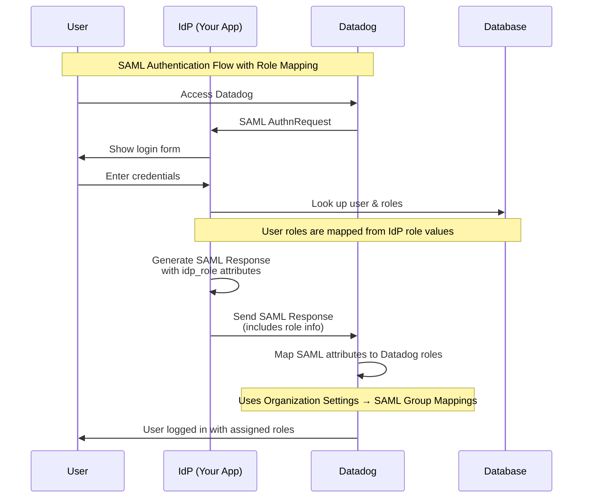

# SAML Role Mapping Integration

This document explains how to configure and use SAML Role Mapping with Datadog in your IDP application.

## Overview

SAML Role Mapping allows you to automatically assign roles to users based on their role information from your Identity Provider (IdP). When users authenticate via SAML, their IdP roles are mapped to local roles, which are then sent to Datadog for role-based access control.

## How It Works



## Configuration Steps

### Step 1: Create Role Mappings in Your IDP

1. **Access Role Management**
   - Go to the Role Mapping section in your IDP application
   - Click "Create New Role" or "Bulk Create Mappings"

2. **Define Role Mappings**
   ```
   IdP Role Value: "admin"          → Local Role: "Administrator"
   IdP Role Value: "developer"      → Local Role: "Developer"
   IdP Role Value: "readonly"       → Local Role: "Read Only User"
   IdP Role Value: "user"           → Local Role: "Standard User"
   ```

3. **Configure Default Role**
   - Mark one role as "Default" for new users
   - This role is assigned when no specific role mapping exists

### Step 2: Configure SAML Group Mappings in Datadog

1. **Access Datadog Settings**
   - Go to Organization Settings → SAML Group Mappings
   - Select the "Role Mappings" tab

2. **Create Mappings**
   ```
   SAML Attribute: idp_role = "admin"        → Datadog Role: "Admin"
   SAML Attribute: idp_role = "developer"    → Datadog Role: "Developer"
   SAML Attribute: idp_role = "readonly"     → Datadog Role: "Read Only"
   SAML Attribute: idp_role = "user"         → Datadog Role: "Standard"
   ```

3. **Enable Mappings**
   - Click "Enable Mappings" to activate role-based access control
   - ⚠️ **Important**: Users without matching roles will lose access!

### Step 3: Test the Integration

1. **Create Test Roles**
   ```bash
   # Create a test role mapping
   curl -X POST http://localhost:8000/api/roles \
     -H "Content-Type: application/json" \
     -d '{
       "name": "Test Administrator",
       "description": "Test admin role",
       "idp_role_value": "test-admin",
       "active": true
     }'
   ```

2. **Assign Role to User**
   ```bash
   # Assign role to user
   curl -X POST http://localhost:8000/api/roles/1/users/1
   ```

3. **Test SAML Authentication**
   - Access Datadog and initiate SAML login
   - Verify role information is included in SAML assertion
   - Check that user gets correct permissions in Datadog

## SAML Assertion Structure

Your IDP sends role information in the SAML assertion like this:

```xml
<saml:AttributeStatement>
    <saml:Attribute Name="eduPersonPrincipalName">
        <saml:AttributeValue>user@company.com</saml:AttributeValue>
    </saml:Attribute>
    
    <!-- Role mapping attributes -->
    <saml:Attribute Name="idp_role">
        <saml:AttributeValue>admin</saml:AttributeValue>
    </saml:Attribute>
    <saml:Attribute Name="idp_role">
        <saml:AttributeValue>developer</saml:AttributeValue>
    </saml:Attribute>
    
    <!-- Additional attributes -->
    <saml:Attribute Name="department">
        <saml:AttributeValue>Engineering</saml:AttributeValue>
    </saml:Attribute>
    <saml:Attribute Name="team">
        <saml:AttributeValue>Backend</saml:AttributeValue>
    </saml:Attribute>
</saml:AttributeStatement>
```

## API Endpoints

### Role Management

| Method | Endpoint | Description |
|--------|----------|-------------|
| GET | `/api/roles` | List all roles |
| POST | `/api/roles` | Create a new role |
| GET | `/api/roles/{id}` | Get specific role |
| PUT | `/api/roles/{id}` | Update role |
| DELETE | `/api/roles/{id}` | Delete role |

### Role Assignments

| Method | Endpoint | Description |
|--------|----------|-------------|
| POST | `/api/roles/{role_id}/users/{user_id}` | Assign role to user |
| DELETE | `/api/roles/{role_id}/users/{user_id}` | Remove role from user |
| GET | `/api/roles/{role_id}/users` | Get users with role |

### Bulk Operations

| Method | Endpoint | Description |
|--------|----------|-------------|
| POST | `/api/roles/mappings` | Create multiple role mappings |
| POST | `/api/roles/sync-user-roles/{user_id}` | Sync user roles from IdP |

## Role Assignment Scenarios

### Scenario 1: New User with JIT Provisioning

```python
# User doesn't exist, JIT enabled
user_attributes = {
    'email': 'newuser@company.com',
    'first_name': 'New',
    'last_name': 'User',
    'default_roles': ['user']  # Default role for new users
}

# Result: User created with default role
# SAML assertion includes: idp_role = "user"
```

### Scenario 2: Existing User with Multiple Roles

```python
# User exists with roles: ["admin", "developer"]
user_roles = ["admin", "developer"]

# SAML assertion includes:
# <saml:Attribute Name="idp_role">
#   <saml:AttributeValue>admin</saml:AttributeValue>
# </saml:Attribute>
# <saml:Attribute Name="idp_role">
#   <saml:AttributeValue>developer</saml:AttributeValue>
# </saml:Attribute>
```

### Scenario 3: Role Synchronization

```python
# IdP role values from authentication
idp_roles = ["admin", "team-lead"]

# System finds matching local roles and assigns them
# Updates user.idp_roles and user.last_role_sync
```

## Best Practices

### 1. Role Naming Convention

```
IdP Role Value    → Local Role Name       → Datadog Role
admin            → Administrator         → Admin
dev-lead         → Development Lead      → Developer
qa-engineer      → QA Engineer          → Tester
user             → Standard User         → Standard
readonly         → Read Only User        → Read Only
```

### 2. Default Role Strategy

- Always have a default role for new users
- Use the least privileged role as default
- Consider department-specific defaults

### 3. Role Lifecycle Management

```python
# Regular role sync for existing users
POST /api/roles/sync-user-roles/{user_id}
{
    "idp_roles": ["developer", "team-lead"]
}

# Bulk role mapping updates
POST /api/roles/mappings
[
    {
        "idp_role_value": "senior-dev",
        "role_name": "Senior Developer",
        "description": "Senior development role",
        "active": true
    }
]
```

### 4. Error Handling

```python
# Handle missing role mappings
if not matching_roles and not default_role:
    # Log warning and assign minimal access
    logger.warning(f"No role mapping found for user {email}")
    
# Handle Datadog mapping failures
if datadog_mapping_enabled and not user_has_datadog_role:
    # User may lose access - implement fallback
    logger.error(f"User {email} may lose Datadog access")
```

## Troubleshooting

### Common Issues

1. **User Loses Access After Enabling Mappings**
   - **Cause**: No role mapping exists for user's IdP roles
   - **Solution**: Create role mapping or assign default role

2. **Roles Not Appearing in SAML Assertion**
   - **Cause**: User has no roles assigned or roles are inactive
   - **Solution**: Check role assignments and active status

3. **Datadog Not Recognizing Role Mappings**
   - **Cause**: SAML attribute name mismatch or mappings not enabled
   - **Solution**: Verify attribute name is `idp_role` and enable mappings

### Debugging Tools

1. **Check SAML Assertion**
   ```bash
   # Enable SAML response logging
   export SAML_DEBUG=true
   
   # Check logs for SAML assertion content
   tail -f logs/saml.log | grep "idp_role"
   ```

2. **Verify Role Assignments**
   ```bash
   # Get user's roles
   curl http://localhost:8000/api/users/{user_id} | jq '.roles'
   
   # Check role mappings
   curl http://localhost:8000/api/roles | jq '.[] | select(.idp_role_value)'
   ```

3. **Test Role Sync**
   ```bash
   # Manually sync user roles
   curl -X POST http://localhost:8000/api/roles/sync-user-roles/1 \
     -H "Content-Type: application/json" \
     -d '["admin", "developer"]'
   ```

## Security Considerations

### 1. Role Validation

- Validate IdP role values before assignment
- Implement role hierarchy and inheritance
- Audit role changes and assignments

### 2. Access Control

- Use least privilege principle
- Regular role reviews and cleanup
- Monitor role-based access patterns

### 3. Integration Security

- Secure role attribute transmission
- Validate SAML assertions thoroughly
- Implement role mapping change controls

## Migration Guide

### From Basic SAML to Role Mapping

1. **Audit Current Users**
   ```bash
   # Export current user list
   curl http://localhost:8000/api/users > current_users.json
   ```

2. **Define Role Mapping Strategy**
   - Map existing users to appropriate roles
   - Define role hierarchy
   - Plan default role assignments

3. **Gradual Rollout**
   ```python
   # Phase 1: Create role mappings without enforcement
   # Phase 2: Assign roles to existing users
   # Phase 3: Enable role-based access in Datadog
   # Phase 4: Monitor and adjust
   ```

4. **Validation**
   - Test with limited user group
   - Verify all users retain appropriate access
   - Monitor for access issues

## Conclusion

SAML Role Mapping provides powerful integration between your Identity Provider and Datadog's role-based access control. By following this guide, you can implement secure, automated role assignment that scales with your organization.

For additional support or questions, refer to the API documentation at `/docs` or contact your system administrator. 